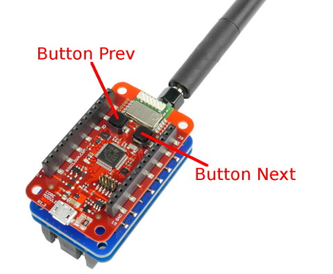

# BigClown bcp-sigfox-presenter



[](https://www.youtube.com/watch?v=B744ltToEZI)

* Clone reository
    ```
    git clone --recursive https://github.com/blavka/bcp-sigfox-presenter.git
    ```

* Make firmware
    ```
    make release
    ```

* Upload firmware to core
    ```
    make dfu
    ```

* Install [localtunel](https://localtunnel.me)
	```
	sudo npm install -g localtunnel
	```

* Install Pyhton3 packages
	```
	sudo pip3 install -r requirements.txt
	```

* Run server
    ```
    .server.py
    ```

* Run localtunnel
    ```
    lt --port 8080
    ```

    Or run with own subdomain
    ```
    lt --port 8080 --subdomain bcpsigfoxpresenter
    ```

* Configure http callback in sigfox
